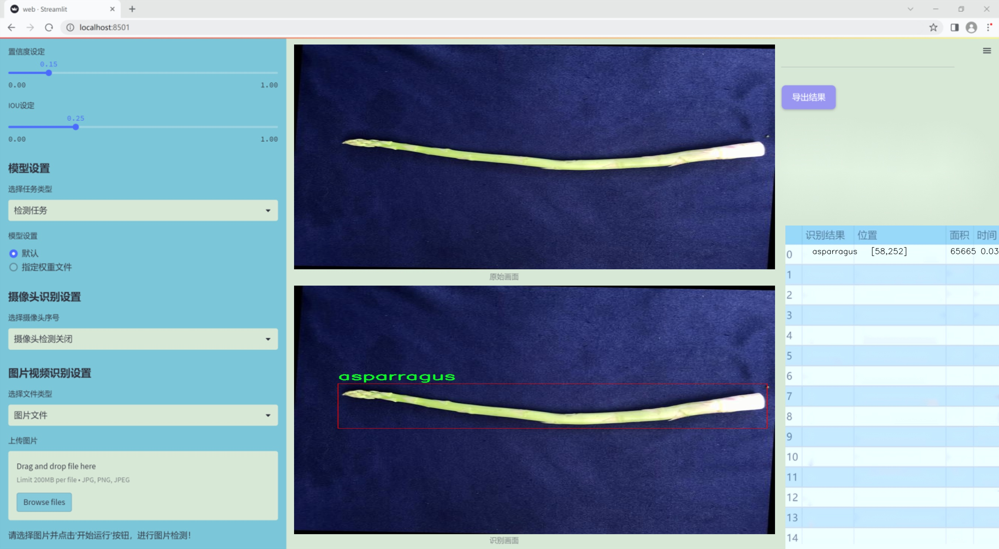
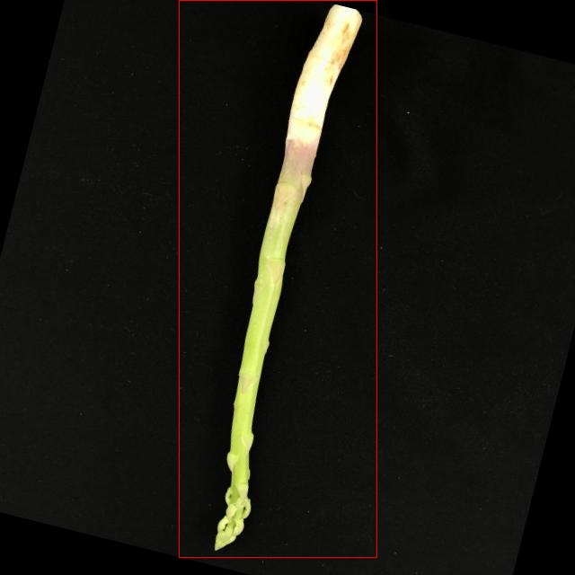

### 1.背景意义

研究背景与意义

随着全球农业生产的不断发展，农作物的智能化管理和监测成为了提升农业生产效率的重要手段。芦笋作为一种高营养价值的蔬菜，近年来在市场上的需求逐渐增加，然而传统的人工检测和分类方法不仅耗时耗力，而且容易受到人为因素的影响。因此，开发一种高效、准确的芦笋检测系统显得尤为重要。

在计算机视觉领域，目标检测技术的快速发展为农业智能化提供了新的解决方案。YOLO（You Only Look Once）系列模型因其高效的实时检测能力而广泛应用于各类目标检测任务。YOLOv11作为该系列的最新版本，具备更强的特征提取能力和更快的推理速度，适合用于复杂的农业场景。通过对YOLOv11的改进，可以进一步提升其在芦笋检测中的性能，尤其是在处理不同生长阶段和环境条件下的芦笋图像时。

本研究所使用的数据集包含8755张经过精心标注的芦笋图像，涵盖了不同的拍摄角度和环境变化。数据集的构建经过了严格的预处理和增强，确保了模型训练的多样性和鲁棒性。这一数据集不仅为模型的训练提供了丰富的样本，也为后续的性能评估奠定了基础。

通过建立基于改进YOLOv11的芦笋检测系统，我们希望能够实现对芦笋的高效、准确检测，从而为农业生产提供智能化的解决方案。该系统的成功应用将有助于提升芦笋的采摘效率和质量控制，进而推动农业现代化的发展。最终，我们期望这一研究能够为其他农作物的智能检测提供借鉴，促进计算机视觉技术在农业领域的广泛应用。

### 2.视频效果

[2.1 视频效果](https://www.bilibili.com/video/BV12EmxYCE2t/)

### 3.图片效果




##### [项目涉及的源码数据来源链接](https://kdocs.cn/l/cszuIiCKVNis)**

注意：本项目提供训练的数据集和训练教程,由于版本持续更新,暂不提供权重文件（best.pt）,请按照6.训练教程进行训练后实现上图演示的效果。

### 4.数据集信息

##### 4.1 本项目数据集类别数＆类别名

nc: 1
names: ['asparragus']


该项目为【目标检测】数据集，请在【训练教程和Web端加载模型教程（第三步）】这一步的时候按照【目标检测】部分的教程来训练

##### 4.2 本项目数据集信息介绍

本项目数据集信息介绍

本项目旨在改进YOLOv11的芦笋检测系统，所使用的数据集专注于“芦笋等级2”的检测与分类。该数据集包含了大量与芦笋相关的图像数据，旨在为模型提供丰富的训练样本，以提高其在实际应用中的检测精度和可靠性。数据集中涵盖的类别数量为1，具体类别为“asparragus”，这意味着所有的图像均为芦笋的不同样本。这一单一类别的设计使得模型能够专注于芦笋的特征提取，从而在检测过程中减少混淆，提高识别效率。

在数据集的构建过程中，考虑到了芦笋的生长环境、采摘时间以及不同生长阶段的外观差异。图像来源于多种场景，包括农田、市场和加工厂等，确保了数据的多样性和代表性。此外，数据集中的图像经过精心标注，确保每个样本都能准确反映芦笋的特征，如颜色、形状和大小等。这些标注不仅为模型的训练提供了基础，也为后续的评估和优化提供了依据。

通过使用这一数据集，改进后的YOLOv11模型将能够更有效地识别和分类芦笋，尤其是在复杂背景下的表现将得到显著提升。数据集的设计旨在模拟真实世界中的应用场景，使得模型在实际部署时能够应对各种挑战，从而实现更高的检测准确率和更快的处理速度。总之，本项目的数据集为芦笋检测系统的训练提供了坚实的基础，期待其在农业生产和市场流通中的广泛应用。





### 5.全套项目环境部署视频教程（零基础手把手教学）

[5.1 所需软件PyCharm和Anaconda安装教程（第一步）](https://www.bilibili.com/video/BV1BoC1YCEKi/?spm_id_from=333.999.0.0&vd_source=bc9aec86d164b67a7004b996143742dc)


[5.2 安装Python虚拟环境创建和依赖库安装视频教程（第二步）](https://www.bilibili.com/video/BV1ZoC1YCEBw?spm_id_from=333.788.videopod.sections&vd_source=bc9aec86d164b67a7004b996143742dc)

### 6.改进YOLOv11训练教程和Web_UI前端加载模型教程（零基础手把手教学）

[6.1 改进YOLOv11训练教程和Web_UI前端加载模型教程（第三步）](https://www.bilibili.com/video/BV1BoC1YCEhR?spm_id_from=333.788.videopod.sections&vd_source=bc9aec86d164b67a7004b996143742dc)


按照上面的训练视频教程链接加载项目提供的数据集，运行train.py即可开始训练



     Epoch   gpu_mem       box       obj       cls    labels  img_size
     1/200     20.8G   0.01576   0.01955  0.007536        22      1280: 100%|██████████| 849/849 [14:42<00:00,  1.04s/it]
               Class     Images     Labels          P          R     mAP@.5 mAP@.5:.95: 100%|██████████| 213/213 [01:14<00:00,  2.87it/s]
                 all       3395      17314      0.994      0.957      0.0957      0.0843

     Epoch   gpu_mem       box       obj       cls    labels  img_size
     2/200     20.8G   0.01578   0.01923  0.007006        22      1280: 100%|██████████| 849/849 [14:44<00:00,  1.04s/it]
               Class     Images     Labels          P          R     mAP@.5 mAP@.5:.95: 100%|██████████| 213/213 [01:12<00:00,  2.95it/s]
                 all       3395      17314      0.996      0.956      0.0957      0.0845

     Epoch   gpu_mem       box       obj       cls    labels  img_size
     3/200     20.8G   0.01561    0.0191  0.006895        27      1280: 100%|██████████| 849/849 [10:56<00:00,  1.29it/s]
               Class     Images     Labels          P          R     mAP@.5 mAP@.5:.95: 100%|███████   | 187/213 [00:52<00:00,  4.04it/s]
                 all       3395      17314      0.996      0.957      0.0957      0.0845


###### [项目数据集下载链接](https://kdocs.cn/l/cszuIiCKVNis)

### 7.原始YOLOv11算法讲解


YOLO11 是 Ultralytics YOLO 系列的最新版本，结合了尖端的准确性、速度和效率，用于目标检测、分割、分类、定向边界框和姿态估计。与
YOLOv8 相比，它具有更少的参数和更好的结果，不难预见，YOLO11 在边缘设备上更高效、更快，将频繁出现在计算机视觉领域的最先进技术（SOTA）中。


**主要特点**

  * **增强的特征提取：**YOLO11 使用改进的主干和颈部架构来增强特征提取，以实现更精确的目标检测和复杂任务的性能。

  * **针对效率和速度优化：**精细的架构设计和优化的训练流程在保持准确性和性能之间最佳平衡的同时，提供更快的处理速度。

  * **更少的参数，更高的准确度：**YOLO11m 在 COCO 数据集上实现了比 YOLOv8m 更高的 mAP，参数减少了 22%，提高了计算效率，同时不牺牲准确度。

  * **跨环境的适应性：**YOLO11 可以无缝部署在边缘设备、云平台和配备 NVIDIA GPU 的系统上，确保最大的灵活性。

  * **支持广泛的任务范围：**YOLO11 支持各种计算机视觉任务，如目标检测、实例分割、图像分类、姿态估计和定向目标检测（OBB）。


### 8.200+种全套改进YOLOV11创新点原理讲解

#### 8.1 200+种全套改进YOLOV11创新点原理讲解大全

由于篇幅限制，每个创新点的具体原理讲解就不全部展开，具体见下列网址中的改进模块对应项目的技术原理博客网址【Blog】（创新点均为模块化搭建，原理适配YOLOv5~YOLOv11等各种版本）

[改进模块技术原理博客【Blog】网址链接](https://gitee.com/qunmasj/good)


#### 8.2 精选部分改进YOLOV11创新点原理讲解

###### 这里节选部分改进创新点展开原理讲解(完整的改进原理见上图和[改进模块技术原理博客链接](https://gitee.com/qunmasj/good)【如果此小节的图加载失败可以通过CSDN或者Github搜索该博客的标题访问原始博客，原始博客图片显示正常】

### 高效网络架构 CloAtt简介
众所周知，自从 ViTs 提出后，Transformer 基本横扫各大 CV 主流任务，包括视觉识别、目标检测和语义分割等。然而，一个比较棘手的问题就是这个架构参数量和计算量太大，所以一直被广受诟病。因此，后续有不少工作都是朝着这个方向去改进，例如 Swin-Transformer 在局部非重叠窗口中进行注意力计算，而 PVT 中则是使用平均池化来合并 token 以进一步压缩耗时。然而，这些 ViTs 由于其参数量太大以及高 FLOPs 并不适合部署到移动设备。如果我们直接缩小到适合移动设备的尺寸时，它们的性能又会显著降低。


#### MobileViT
因此，出现了不少工作聚焦于探索轻量级的视觉变换器，使 ViTs 适用于移动设备，CVHub 此前也介绍过不少的工作，大家有兴趣可以翻阅历史文章读读。例如，苹果团队提出的 MobileViT 研究了如何将 CNN 与 Transformer 相结合，而另一个工作 MobileFormer 则将轻量级的 MobileNet 与 Transformer 进行融合。此外，最新提出的 EdgeViT 提出了一个局部-全局-局部模块来聚合信息。以上工作的目标都是设计具有高性能、较少参数和低 FLOPs 的移动端友好型模型。


#### EdgeViT
然而，作者从频域编码的角度认为，在现有的轻量级模型中，大多数方法只关注设计稀疏注意力，以有效地处理低频全局信息，而使用相对简单的方法处理高频局部信息。具体而言，大多数模型如 EdgeViT 和 MobileViT，只是简单使用原始卷积提取局部表示，这些方法仅使用卷积中的全局共享权重处理高频本地信息。其他方法，如 LVT ，则是首先将标记展开到窗口中，然后使用窗口内的注意力获得高频信息。这些方法仅使用特定于每个 Token 的上下文感知权重进行局部感知。


#### LVT
虽然上述轻量级模型在多个数据集上取得了良好的结果，但没有一种方法尝试设计更有效的方法，即利用共享和上下文感知权重的优势来处理高频局部信息。基于共享权重的方法，如传统的卷积神经网络，具有平移等变性的特征。与它们不同，基于上下文感知权重的方法，如 LVT 和 NAT，具有可以随输入内容变化的权重。这两种类型的权重在局部感知中都有自己的优势。
#### NAT


受该博客的启发，本文设计了一种轻量级视觉变换器——CloAtt，其利用了上下文感知的局部增强。特别地，CloAtt 采用了双分支设计结构。
#### 局部分支
在局部分支中，本文引入了一个精心设计的 AttnConv，一种简单而有效的卷积操作符，它采用了注意力机制的风格。所提出的 AttnConv 有效地融合了共享权重和上下文感知权重，以聚合高频的局部信息。具体地，AttnConv 首先使用深度卷积（DWconv）提取局部表示，其中 DWconv 具有共享权重。然后，其使用上下文感知权重来增强局部特征。与 Non-Local 等生成上下文感知权重的方法不同，AttnConv 使用门控机制生成上下文感知权重，引入了比常用的注意力机制更强的非线性。此外，AttnConv 将卷积算子应用于 Query 和 Key 以聚合局部信息，然后计算 Q 和 K 的哈达玛积，并对结果进行一系列线性或非线性变换，生成范围在 [-1,1] 之间的上下文感知权重。值得注意的是，AttnConv 继承了卷积的平移等变性，因为它的所有操作都基于卷积。
#### 全局分支
在全局分支中则使用了传统的注意力机制，但对 K 和 V 进行了下采样以减少计算量，从而捕捉低频全局信息。最后，CloFormer 通过简单的方法将局部分支和全局分支的输出进行融合，从而使模型能够同时捕捉高频和低频信息。总的来说，CloFormer 的设计能够同时发挥共享权重和上下文感知权重的优势，提高其局部感知的能力，使其在图像分类、物体检测和语义分割等多个视觉任务上均取得了优异的性能。
如上图2所示，CloFormer 共包含一个卷积主干和四个 stage，每个 stage you Clo 模块 和 ConvFFN 组合而成的模块堆叠而成 。具体得，首先将输入图像通过卷积主干传递，以获取 token 表示。该主干由四个卷积组成，每个卷积的步长依次为2、2、1和1。接下来，tokens 经历四个 Clo 块和 ConvFFN 阶段，以提取分层特征。最后，再利用全局平均池化和全连接层生成预测结果。可以看出，整个架构非常简洁，支持即插即用！


#### ConvFFN
为了将局部信息融入 FFN 过程中，本文采用 ConvFFN 替换了常用的 FFN。ConvFFN 和常用的 FFN 的主要区别在于，ConvFFN 在 GELU 激活函数之后使用了深度卷积（DWconv），从而使 ConvFFN 能够聚合局部信息。由于DWconv 的存在，可以直接在 ConvFFN 中进行下采样而不需要引入 PatchMerge 模块。CloFormer 使用了两种ConvFFN。第一种是在阶段内的 ConvFFN，它直接利用跳跃连接。另一种是连接两个阶段的 ConvFFN，主要用于下采样操作。
#### Clo block
CloFormer 中的 Clo块 是非常关键的组件。每个 Clo 块由一个局部分支和一个全局分支组成。在全局分支中，我们首先下采样 K 和 V，然后对 Q、K 和 V 进行标准的 attention 操作，以提取低频全局信息。
虽然全局分支的设计能够有效减少注意力机制所需的浮点运算次数，并且能够获得全局的感受野。然而，它在处理高频局部信息方面的能力不足。为了解决这个问题，CloFormer 引入了局部分支，并使用 AttnConv 对高频局部信息进行处理。AttnConv 可以融合共享权重和上下文感知权重，能够更好地处理高频局部信息。因此，CloFormer 结合了全局和局部的优势来提高图像分类性能。下面我们重点讲下 AttnConv 。
#### AttnConv
AttnConv 是一个关键模块，使得所提模型能够获得高性能。它结合了一些标准的 attention 操作。具体而言，在AttnConv 中，我们首先进行线性变换以获得 Q、K和V。在进行线性变换之后，我们再对 V 进行共享权重的局部特征聚合。然后，基于处理后的 V 和 Q ，K 进行上下文感知的局部增强。具体流程可对照流程图理解，我们可以将其拆解成三个步骤。
#### Local Feature Aggregation
为了简单起见，本文直接使用一个简单的深度卷积（DWconv）来对 V 进行局部信息聚合。
#### Context-aware Local Enhancement
在将具有共享权重的局部信息整合到 V 中后，我们结合 Q 和 K 生成上下文感知权重。值得注意的是，我们使用了与局部自注意力不同的方法，该方法更加简洁。具体而言，我们首先使用两个 DWconv 对 Q 和 K 分别进行局部信息聚合。然后，我们计算 Q 和 K 的 Hadamard 乘积，并对结果进行一系列转换，以获取在 -1 到 1 之间的上下文感知权重。最后，我们使用生成的权重来增强局部特征。
#### Fusion with Global Branch
在整个 CloFormer 中，我们使用一种简单直接的方法来将局部分支和全局分支的输出进行融合。具体而言，本文是通过将这两个输出在通道维度上进行直接拼接，然后再通过一个 FC 层聚合这些特征并结合残差输出。
最后，上图展示了三种不同的方法。相比于传统卷积，AttnConv 中的上下文感知权重使得模型能够更好地适应输入内容。相比于局部自注意力机制，引入共享权重使得模型能够更好地处理高频信息，从而提高性能。此外，生成上下文感知权重的方法引入了更强的非线性性，也提高了性能。需要注意的是，AttnConv 中的所有操作都基于卷积，保持了卷积的平移等变性特性。


### 9.系统功能展示

图9.1.系统支持检测结果表格显示

  图9.2.系统支持置信度和IOU阈值手动调节

  图9.3.系统支持自定义加载权重文件best.pt(需要你通过步骤5中训练获得)

  图9.4.系统支持摄像头实时识别

  图9.5.系统支持图片识别

  图9.6.系统支持视频识别

  图9.7.系统支持识别结果文件自动保存

  图9.8.系统支持Excel导出检测结果数据


### 10. YOLOv11核心改进源码讲解

#### 10.1 metaformer.py

以下是经过简化和注释的核心代码部分，保留了最重要的类和方法，并对其进行了详细的中文注释：

```python
import torch
import torch.nn as nn
import torch.nn.functional as F

class Scale(nn.Module):
    """
    通过元素乘法对向量进行缩放的模块。
    """
    def __init__(self, dim, init_value=1.0, trainable=True):
        super().__init__()
        # 初始化可训练的缩放参数
        self.scale = nn.Parameter(init_value * torch.ones(dim), requires_grad=trainable)

    def forward(self, x):
        # 对输入进行缩放
        return x * self.scale

class MF_Attention(nn.Module):
    """
    自注意力机制模块，源自Transformer。
    """
    def __init__(self, dim, head_dim=32, num_heads=None, qkv_bias=False,
                 attn_drop=0., proj_drop=0., proj_bias=False):
        super().__init__()
        self.head_dim = head_dim
        self.scale = head_dim ** -0.5  # 缩放因子

        # 计算头的数量
        self.num_heads = num_heads if num_heads else dim // head_dim
        if self.num_heads == 0:
            self.num_heads = 1
        
        self.attention_dim = self.num_heads * self.head_dim

        # 定义线性层用于计算Q、K、V
        self.qkv = nn.Linear(dim, self.attention_dim * 3, bias=qkv_bias)
        self.attn_drop = nn.Dropout(attn_drop)  # 注意力丢弃层
        self.proj = nn.Linear(self.attention_dim, dim, bias=proj_bias)  # 投影层
        self.proj_drop = nn.Dropout(proj_drop)  # 投影丢弃层

    def forward(self, x):
        B, H, W, C = x.shape  # B: 批量大小, H: 高度, W: 宽度, C: 通道数
        N = H * W  # 计算总的空间维度
        # 计算Q、K、V
        qkv = self.qkv(x).reshape(B, N, 3, self.num_heads, self.head_dim).permute(2, 0, 3, 1, 4)
        q, k, v = qkv.unbind(0)  # 分离Q、K、V

        # 计算注意力分数
        attn = (q @ k.transpose(-2, -1)) * self.scale
        attn = attn.softmax(dim=-1)  # 归一化
        attn = self.attn_drop(attn)  # 应用丢弃

        # 计算输出
        x = (attn @ v).transpose(1, 2).reshape(B, H, W, self.attention_dim)
        x = self.proj(x)  # 投影到原始维度
        x = self.proj_drop(x)  # 应用丢弃
        return x

class MetaFormerBlock(nn.Module):
    """
    MetaFormer模块的实现。
    """
    def __init__(self, dim, token_mixer=nn.Identity, mlp=Mlp,
                 norm_layer=partial(LayerNormWithoutBias, eps=1e-6),
                 drop=0., drop_path=0.):
        super().__init__()

        self.norm1 = norm_layer(dim)  # 第一层归一化
        self.token_mixer = token_mixer(dim=dim, drop=drop)  # 令牌混合器
        self.drop_path1 = DropPath(drop_path) if drop_path > 0. else nn.Identity()  # 随机丢弃路径
        self.layer_scale1 = Scale(dim=dim)  # 第一层缩放
        self.res_scale1 = Scale(dim=dim)  # 第一层残差缩放

        self.norm2 = norm_layer(dim)  # 第二层归一化
        self.mlp = mlp(dim=dim, drop=drop)  # MLP模块
        self.drop_path2 = DropPath(drop_path) if drop_path > 0. else nn.Identity()  # 随机丢弃路径
        self.layer_scale2 = Scale(dim=dim)  # 第二层缩放
        self.res_scale2 = Scale(dim=dim)  # 第二层残差缩放

    def forward(self, x):
        x = x.permute(0, 2, 3, 1)  # 调整维度顺序
        # 第一部分
        x = self.res_scale1(x) + \
            self.layer_scale1(
                self.drop_path1(
                    self.token_mixer(self.norm1(x))
                )
            )
        # 第二部分
        x = self.res_scale2(x) + \
            self.layer_scale2(
                self.drop_path2(
                    self.mlp(self.norm2(x))
                )
            )
        return x.permute(0, 3, 1, 2)  # 恢复维度顺序
```

### 代码分析
1. **Scale类**：用于实现可训练的缩放因子，允许对输入进行元素级别的缩放。
2. **MF_Attention类**：实现了自注意力机制，计算输入的注意力权重，并通过线性层进行投影。
3. **MetaFormerBlock类**：实现了MetaFormer的基本构建块，包含了归一化、令牌混合、MLP等模块，并支持残差连接和路径丢弃。

以上代码片段保留了核心功能，并添加了详细的中文注释，以便于理解每个部分的作用。

这个文件 `metaformer.py` 实现了一种名为 MetaFormer 的神经网络架构，主要用于处理图像等高维数据。文件中定义了多个类，每个类都代表了网络中的不同组件。下面对这些组件进行逐一说明。

首先，`Scale` 类用于对输入进行逐元素的缩放操作，使用一个可训练的参数 `scale` 来实现。这种缩放可以帮助模型在训练过程中学习到更合适的特征表示。

接下来，`SquaredReLU` 和 `StarReLU` 类实现了不同的激活函数。`SquaredReLU` 是一种将 ReLU 激活函数的输出平方的激活函数，而 `StarReLU` 则在 ReLU 输出的基础上引入了可学习的缩放和偏置参数。

`MF_Attention` 类实现了自注意力机制，类似于 Transformer 中的自注意力。它通过线性变换生成查询、键和值，然后计算注意力权重，并通过加权求和得到输出。该类支持多头注意力机制，可以在多个头上并行计算注意力。

`RandomMixing` 类通过一个随机矩阵对输入进行混合操作，这种方法可以用于增强模型的表达能力。

`LayerNormGeneral` 类实现了一种通用的层归一化，允许用户指定归一化的维度和是否使用缩放和偏置。它适用于多种输入形状，提供了灵活性。

`LayerNormWithoutBias` 类是一个优化版本的层归一化，不使用偏置项，直接调用 PyTorch 的优化函数 `F.layer_norm`。

`SepConv` 类实现了分离卷积，这是一种在 MobileNetV2 中使用的卷积方式。它通过逐点卷积和深度卷积的组合来减少计算量。

`Pooling` 类实现了一种池化操作，类似于 PoolFormer 中的实现。它通过平均池化来提取特征，并返回输入与池化结果的差值。

`Mlp` 类实现了多层感知机（MLP），通常用于 MetaFormer 模型中。它包含两个线性层和激活函数，并在每个层之间使用 dropout。

`ConvolutionalGLU` 类实现了一种卷积门控线性单元（GLU），它结合了卷积和门控机制，以增强模型的表达能力。

`MetaFormerBlock` 类是 MetaFormer 的基本构建块，包含了归一化、令牌混合、MLP 以及残差连接等功能。它支持可选的层缩放和残差缩放。

`MetaFormerCGLUBlock` 类与 `MetaFormerBlock` 类类似，但使用了卷积门控线性单元作为 MLP。这种设计使得模型能够更好地捕捉空间特征。

整体来看，这个文件实现了一个灵活且高效的 MetaFormer 网络结构，适用于各种视觉任务。通过组合不同的模块，用户可以根据需求调整网络的结构和功能。

#### 10.2 kernel_warehouse.py

以下是经过简化和注释的核心代码部分，主要集中在 `Attention` 和 `KWConvNd` 类的实现上：

```python
import torch
import torch.nn as nn
import torch.nn.functional as F

class Attention(nn.Module):
    def __init__(self, in_planes, reduction, num_static_cell, num_local_mixture, norm_layer=nn.BatchNorm1d,
                 cell_num_ratio=1.0, nonlocal_basis_ratio=1.0, start_cell_idx=None):
        super(Attention, self).__init__()
        # 计算隐藏层的通道数
        hidden_planes = max(int(in_planes * reduction), 16)
        self.kw_planes_per_mixture = num_static_cell + 1  # 每个混合的关键字平面数
        self.num_local_mixture = num_local_mixture  # 本地混合数
        self.kw_planes = self.kw_planes_per_mixture * num_local_mixture  # 总的关键字平面数

        # 计算本地和非本地单元的数量
        self.num_local_cell = int(cell_num_ratio * num_local_mixture)
        self.num_nonlocal_cell = num_static_cell - self.num_local_cell
        self.start_cell_idx = start_cell_idx

        # 定义网络层
        self.avgpool = nn.AdaptiveAvgPool1d(1)  # 自适应平均池化
        self.fc1 = nn.Linear(in_planes, hidden_planes, bias=(norm_layer is not nn.BatchNorm1d))  # 全连接层
        self.norm1 = norm_layer(hidden_planes)  # 归一化层
        self.act1 = nn.ReLU(inplace=True)  # 激活函数

        # 根据非本地基础比率决定映射方式
        if nonlocal_basis_ratio >= 1.0:
            self.map_to_cell = nn.Identity()  # 直接映射
            self.fc2 = nn.Linear(hidden_planes, self.kw_planes, bias=True)  # 第二个全连接层
        else:
            self.map_to_cell = self.map_to_cell_basis  # 使用基础映射
            self.num_basis = max(int(self.num_nonlocal_cell * nonlocal_basis_ratio), 16)  # 基础数量
            self.fc2 = nn.Linear(hidden_planes, (self.num_local_cell + self.num_basis + 1) * num_local_mixture, bias=False)
            self.fc3 = nn.Linear(self.num_basis, self.num_nonlocal_cell, bias=False)  # 用于非本地单元的映射
            self.basis_bias = nn.Parameter(torch.zeros([self.kw_planes]), requires_grad=True).float()  # 基础偏置

        self.temp_bias = torch.zeros([self.kw_planes], requires_grad=False).float()  # 温度偏置
        self.temp_value = 0  # 温度值
        self._initialize_weights()  # 初始化权重

    def _initialize_weights(self):
        # 权重初始化
        for m in self.modules():
            if isinstance(m, nn.Linear):
                nn.init.kaiming_normal_(m.weight, mode='fan_out', nonlinearity='relu')  # Kaiming初始化
                if m.bias is not None:
                    nn.init.constant_(m.bias, 0)  # 偏置初始化为0
            if isinstance(m, nn.BatchNorm1d):
                nn.init.constant_(m.weight, 1)  # 归一化层权重初始化为1
                nn.init.constant_(m.bias, 0)  # 偏置初始化为0

    def forward(self, x):
        # 前向传播
        x = self.avgpool(x.reshape(*x.shape[:2], -1)).squeeze(dim=-1)  # 池化
        x = self.act1(self.norm1(self.fc1(x)))  # 线性变换 -> 归一化 -> 激活
        x = self.map_to_cell(self.fc2(x)).reshape(-1, self.kw_planes)  # 映射到单元
        x = x / (torch.sum(torch.abs(x), dim=1).view(-1, 1) + 1e-3)  # 归一化
        x = (1.0 - self.temp_value) * x + self.temp_value * self.temp_bias.to(x.device).view(1, -1)  # 温度调整
        return x.reshape(-1, self.kw_planes_per_mixture)[:, :-1]  # 返回结果

class KWconvNd(nn.Module):
    def __init__(self, in_planes, out_planes, kernel_size, stride=1, padding=0, dilation=1, groups=1,
                 bias=False, warehouse_id=None, warehouse_manager=None):
        super(KWconvNd, self).__init__()
        self.in_planes = in_planes  # 输入通道数
        self.out_planes = out_planes  # 输出通道数
        self.kernel_size = kernel_size  # 卷积核大小
        self.stride = stride  # 步幅
        self.padding = padding  # 填充
        self.dilation = dilation  # 膨胀
        self.groups = groups  # 分组卷积
        self.bias = nn.Parameter(torch.zeros([self.out_planes]), requires_grad=True).float() if bias else None  # 偏置参数
        self.warehouse_id = warehouse_id  # 仓库ID
        self.warehouse_manager = [warehouse_manager]  # 仓库管理器

    def forward(self, x):
        # 前向传播
        kw_attention = self.attention(x).type(x.dtype)  # 获取注意力权重
        batch_size = x.shape[0]  # 批大小
        x = x.reshape(1, -1, *x.shape[2:])  # 重塑输入
        weight = self.warehouse_manager[0].take_cell(self.warehouse_id).reshape(self.cell_shape[0], -1).type(x.dtype)  # 获取权重
        aggregate_weight = torch.mm(kw_attention, weight)  # 权重聚合
        output = self.func_conv(x, weight=aggregate_weight, bias=None, stride=self.stride, padding=self.padding,
                                dilation=self.dilation, groups=self.groups * batch_size)  # 卷积操作
        output = output.view(batch_size, self.out_planes, *output.shape[2:])  # 重塑输出
        if self.bias is not None:
            output = output + self.bias.reshape(1, -1, *([1]*self.dimension))  # 添加偏置
        return output  # 返回输出
```

### 代码说明
1. **Attention 类**: 这个类实现了一个注意力机制，主要用于动态调整卷积层的权重。它包含了多个全连接层和归一化层，并在前向传播中计算注意力权重。
   
2. **KWconvNd 类**: 这是一个通用的卷积层类，支持多维卷积（1D、2D、3D）。它使用注意力机制来动态调整卷积核的权重，并在前向传播中执行卷积操作。

3. **前向传播**: 在 `forward` 方法中，首先计算注意力权重，然后通过矩阵乘法聚合权重，最后执行卷积操作并返回结果。

通过这些核心部分的实现，可以看出该代码的主要功能是构建一个动态卷积网络，其中卷积层的权重是通过注意力机制动态调整的。

这个程序文件 `kernel_warehouse.py` 实现了一个基于深度学习的卷积层管理系统，主要用于动态管理卷积核（kernel）的存储和使用。文件中包含多个类和函数，下面是对其主要内容的说明。

首先，文件导入了必要的 PyTorch 库，包括神经网络模块、功能模块和自动求导模块。然后定义了一个 `parse` 函数，用于解析输入参数，确保输入的格式符合预期。

接下来，定义了一个 `Attention` 类，该类实现了一个注意力机制，用于动态调整卷积核的权重。该类的构造函数中初始化了一些参数，包括输入通道数、减少比例、静态单元数、局部混合数等。`Attention` 类中还包含了权重初始化、温度更新和前向传播的方法。前向传播方法通过自适应平均池化、线性变换和激活函数处理输入数据，并输出经过注意力机制调整后的卷积核权重。

然后，定义了一个 `KWconvNd` 类，作为卷积层的基类。该类的构造函数接收输入和输出通道数、卷积核大小、步幅、填充、扩张、分组等参数，并根据这些参数解析出相应的维度信息。`KWconvNd` 类还包含了一个 `init_attention` 方法，用于初始化注意力机制，并在前向传播中使用注意力权重与从仓库中获取的卷积核进行计算。

接下来，分别定义了 `KWConv1d`、`KWConv2d` 和 `KWConv3d` 类，分别对应一维、二维和三维卷积操作，继承自 `KWconvNd` 类，并指定相应的维度和卷积函数。

`KWLinear` 类则是一个线性层的实现，内部使用 `KWConv1d` 进行卷积操作。

`Warehouse_Manager` 类是核心组件之一，负责管理卷积核的存储和分配。它的构造函数接收多个参数，用于配置卷积核的减少比例、单元数比率、共享范围等。该类提供了 `reserve` 方法，用于创建动态卷积层并记录其信息，以及 `store` 方法，用于存储卷积核的参数。`allocate` 方法则负责将卷积核分配给网络中的各个层。

最后，定义了一个 `KWConv` 类，它是一个封装了卷积操作、批归一化和激活函数的模块，使用 `Warehouse_Manager` 来管理卷积核。

此外，文件还提供了一个 `get_temperature` 函数，用于根据当前的训练迭代次数和设定的参数计算温度值，这在训练过程中可能用于调整模型的某些超参数。

整体来看，这个文件实现了一个灵活的卷积核管理系统，能够根据网络的需求动态调整和管理卷积核的使用，适用于需要高效卷积操作的深度学习模型。

#### 10.3 fadc.py

以下是经过简化和注释的核心代码部分，主要包括 `OmniAttention` 和 `AdaptiveDilatedConv` 类的实现。代码中的注释详细解释了每个部分的功能和目的。

```python
import torch
import torch.nn as nn
import torch.nn.functional as F

class OmniAttention(nn.Module):
    def __init__(self, in_planes, out_planes, kernel_size, groups=1, reduction=0.0625, kernel_num=4, min_channel=16):
        super(OmniAttention, self).__init__()
        # 计算注意力通道数
        attention_channel = max(int(in_planes * reduction), min_channel)
        self.kernel_size = kernel_size
        self.kernel_num = kernel_num
        self.temperature = 1.0  # 温度参数用于控制注意力的平滑度

        # 定义各个层
        self.avgpool = nn.AdaptiveAvgPool2d(1)  # 自适应平均池化
        self.fc = nn.Conv2d(in_planes, attention_channel, 1, bias=False)  # 全连接层
        self.bn = nn.BatchNorm2d(attention_channel)  # 批归一化
        self.relu = nn.ReLU(inplace=True)  # ReLU激活函数

        # 定义通道注意力、滤波器注意力、空间注意力和核注意力的全连接层
        self.channel_fc = nn.Conv2d(attention_channel, in_planes, 1, bias=True)
        self.func_channel = self.get_channel_attention

        if in_planes == groups and in_planes == out_planes:  # 深度卷积
            self.func_filter = self.skip
        else:
            self.filter_fc = nn.Conv2d(attention_channel, out_planes, 1, bias=True)
            self.func_filter = self.get_filter_attention

        if kernel_size == 1:  # 点卷积
            self.func_spatial = self.skip
        else:
            self.spatial_fc = nn.Conv2d(attention_channel, kernel_size * kernel_size, 1, bias=True)
            self.func_spatial = self.get_spatial_attention

        if kernel_num == 1:
            self.func_kernel = self.skip
        else:
            self.kernel_fc = nn.Conv2d(attention_channel, kernel_num, 1, bias=True)
            self.func_kernel = self.get_kernel_attention

        self._initialize_weights()  # 初始化权重

    def _initialize_weights(self):
        # 权重初始化
        for m in self.modules():
            if isinstance(m, nn.Conv2d):
                nn.init.kaiming_normal_(m.weight, mode='fan_out', nonlinearity='relu')
                if m.bias is not None:
                    nn.init.constant_(m.bias, 0)
            if isinstance(m, nn.BatchNorm2d):
                nn.init.constant_(m.weight, 1)
                nn.init.constant_(m.bias, 0)

    @staticmethod
    def skip(_):
        return 1.0  # 跳过操作，返回1.0

    def get_channel_attention(self, x):
        # 计算通道注意力
        channel_attention = torch.sigmoid(self.channel_fc(x).view(x.size(0), -1, 1, 1) / self.temperature)
        return channel_attention

    def get_filter_attention(self, x):
        # 计算滤波器注意力
        filter_attention = torch.sigmoid(self.filter_fc(x).view(x.size(0), -1, 1, 1) / self.temperature)
        return filter_attention

    def get_spatial_attention(self, x):
        # 计算空间注意力
        spatial_attention = self.spatial_fc(x).view(x.size(0), 1, 1, 1, self.kernel_size, self.kernel_size)
        spatial_attention = torch.sigmoid(spatial_attention / self.temperature)
        return spatial_attention

    def get_kernel_attention(self, x):
        # 计算核注意力
        kernel_attention = self.kernel_fc(x).view(x.size(0), -1, 1, 1, 1, 1)
        kernel_attention = F.softmax(kernel_attention / self.temperature, dim=1)
        return kernel_attention

    def forward(self, x):
        # 前向传播
        x = self.avgpool(x)  # 平均池化
        x = self.fc(x)  # 全连接层
        x = self.bn(x)  # 批归一化
        x = self.relu(x)  # ReLU激活
        return self.func_channel(x), self.func_filter(x), self.func_spatial(x), self.func_kernel(x)

class AdaptiveDilatedConv(nn.Module):
    """自适应膨胀卷积类，封装了可调节的变形卷积层"""

    def __init__(self, in_channels, out_channels, kernel_size, stride=1, padding=0, dilation=1, groups=1, bias=True):
        super(AdaptiveDilatedConv, self).__init__()
        self.conv = nn.Conv2d(in_channels, out_channels, kernel_size, stride=stride, padding=padding, dilation=dilation, groups=groups, bias=bias)
        self.omni_attention = OmniAttention(in_planes=in_channels, out_planes=out_channels, kernel_size=1)  # 添加OmniAttention

    def forward(self, x):
        # 前向传播
        attention_weights = self.omni_attention(x)  # 计算注意力权重
        x = self.conv(x)  # 卷积操作
        return x * attention_weights  # 应用注意力权重
```

### 代码说明
1. **OmniAttention 类**: 该类实现了一个多种注意力机制的模块，包括通道注意力、滤波器注意力、空间注意力和核注意力。通过自适应平均池化和全连接层计算注意力权重，并在前向传播中应用这些权重。

2. **AdaptiveDilatedConv 类**: 该类封装了一个自适应膨胀卷积层，并结合了 `OmniAttention` 模块。通过计算注意力权重来调整卷积输出，从而增强模型的表达能力。

3. **前向传播**: 在 `forward` 方法中，首先计算注意力权重，然后进行卷积操作，最后将卷积结果与注意力权重相乘，以实现加权输出。

通过这种方式，模型能够根据输入特征自适应地调整卷积操作，从而提高性能。

这个程序文件 `fadc.py` 是一个深度学习模型的实现，主要涉及到自适应膨胀卷积（Adaptive Dilated Convolution）和频率选择（Frequency Selection）等技术。代码中使用了 PyTorch 框架，包含了多个类和函数，用于构建复杂的卷积神经网络（CNN）结构。

首先，文件导入了必要的库，包括 PyTorch 的核心模块和一些功能模块。接着，定义了一个名为 `OmniAttention` 的类，这个类实现了一种全局注意力机制，能够根据输入特征的不同通道、过滤器、空间位置和卷积核数量来生成相应的注意力权重。这个类的构造函数中，首先计算了注意力通道的数量，并初始化了一系列卷积层和激活函数，用于计算不同类型的注意力。`forward` 方法则定义了前向传播过程，通过对输入进行池化、卷积和激活，最终输出不同的注意力权重。

接下来，定义了一个名为 `generate_laplacian_pyramid` 的函数，用于生成拉普拉斯金字塔。这种金字塔结构在图像处理中常用于多尺度特征提取。函数通过对输入张量进行下采样和上采样，计算出每一层的拉普拉斯特征，并将其存储在列表中返回。

然后，定义了 `FrequencySelection` 类，该类用于选择输入特征的频率成分。构造函数中，初始化了一系列卷积层和池化层，根据给定的参数配置选择不同的频率处理方式。`forward` 方法则实现了前向传播，计算输入特征的频率权重，并根据这些权重对输入进行加权处理。

接下来，定义了 `AdaptiveDilatedConv` 类，它是对可调形变卷积的封装，允许使用自适应的膨胀卷积。该类的构造函数中，初始化了偏移量卷积层和掩码卷积层，并根据需要选择是否使用全局注意力机制。`forward` 方法实现了卷积操作，结合了偏移量和掩码的计算，最终输出卷积结果。

最后，定义了 `AdaptiveDilatedDWConv` 类，类似于 `AdaptiveDilatedConv`，但主要用于深度可分离卷积。这个类的构造函数和前向传播方法与前者类似，但增加了对普通卷积的支持，允许将普通卷积与自适应膨胀卷积结合使用。

总体而言，这个程序文件实现了一个复杂的卷积神经网络结构，结合了注意力机制、频率选择和自适应卷积等技术，适用于图像处理和计算机视觉任务。

#### 10.4 mobilenetv4.py

以下是代码中最核心的部分，并附上详细的中文注释：

```python
import torch
import torch.nn as nn

# 定义模型规格字典，包含不同版本的 MobileNetV4 的结构
MODEL_SPECS = {
    "MobileNetV4ConvSmall": MNV4ConvSmall_BLOCK_SPECS,
    "MobileNetV4ConvMedium": MNV4ConvMedium_BLOCK_SPECS,
    "MobileNetV4ConvLarge": MNV4ConvLarge_BLOCK_SPECS,
    "MobileNetV4HybridMedium": MNV4HybridConvMedium_BLOCK_SPECS,
    "MobileNetV4HybridLarge": MNV4HybridConvLarge_BLOCK_SPECS,
}

def conv_2d(inp, oup, kernel_size=3, stride=1, groups=1, bias=False, norm=True, act=True):
    """
    创建一个2D卷积层，包含卷积、批归一化和激活函数。
    
    Args:
        inp: 输入通道数
        oup: 输出通道数
        kernel_size: 卷积核大小
        stride: 步幅
        groups: 分组卷积的组数
        bias: 是否使用偏置
        norm: 是否使用批归一化
        act: 是否使用激活函数

    Returns:
        包含卷积层、批归一化层和激活函数的序列模块
    """
    conv = nn.Sequential()
    padding = (kernel_size - 1) // 2  # 计算填充
    conv.add_module('conv', nn.Conv2d(inp, oup, kernel_size, stride, padding, bias=bias, groups=groups))
    if norm:
        conv.add_module('BatchNorm2d', nn.BatchNorm2d(oup))  # 添加批归一化层
    if act:
        conv.add_module('Activation', nn.ReLU6())  # 添加ReLU6激活函数
    return conv

class InvertedResidual(nn.Module):
    def __init__(self, inp, oup, stride, expand_ratio, act=False):
        """
        定义反向残差块，包含扩展卷积和深度卷积。
        
        Args:
            inp: 输入通道数
            oup: 输出通道数
            stride: 步幅
            expand_ratio: 扩展比例
            act: 是否使用激活函数
        """
        super(InvertedResidual, self).__init__()
        self.stride = stride
        assert stride in [1, 2]  # 步幅只能是1或2
        hidden_dim = int(round(inp * expand_ratio))  # 计算隐藏层通道数
        self.block = nn.Sequential()
        if expand_ratio != 1:
            self.block.add_module('exp_1x1', conv_2d(inp, hidden_dim, kernel_size=1, stride=1))  # 扩展卷积
        self.block.add_module('conv_3x3', conv_2d(hidden_dim, hidden_dim, kernel_size=3, stride=stride, groups=hidden_dim))  # 深度卷积
        self.block.add_module('red_1x1', conv_2d(hidden_dim, oup, kernel_size=1, stride=1, act=act))  # 投影卷积
        self.use_res_connect = self.stride == 1 and inp == oup  # 判断是否使用残差连接

    def forward(self, x):
        """
        前向传播函数，执行卷积操作并选择是否使用残差连接。
        
        Args:
            x: 输入张量
        
        Returns:
            输出张量
        """
        if self.use_res_connect:
            return x + self.block(x)  # 使用残差连接
        else:
            return self.block(x)  # 不使用残差连接

class MobileNetV4(nn.Module):
    def __init__(self, model):
        """
        初始化 MobileNetV4 模型，构建各个层。
        
        Args:
            model: 指定模型类型
        """
        super().__init__()
        assert model in MODEL_SPECS.keys()  # 确保模型类型有效
        self.model = model
        self.spec = MODEL_SPECS[self.model]  # 获取模型规格
        
        # 构建模型的各个层
        self.conv0 = build_blocks(self.spec['conv0'])
        self.layer1 = build_blocks(self.spec['layer1'])
        self.layer2 = build_blocks(self.spec['layer2'])
        self.layer3 = build_blocks(self.spec['layer3'])
        self.layer4 = build_blocks(self.spec['layer4'])
        self.layer5 = build_blocks(self.spec['layer5'])
        self.features = nn.ModuleList([self.conv0, self.layer1, self.layer2, self.layer3, self.layer4, self.layer5])  # 将所有层放入ModuleList

    def forward(self, x):
        """
        前向传播函数，依次通过各个层并返回特征图。
        
        Args:
            x: 输入张量
        
        Returns:
            特征图列表
        """
        input_size = x.size(2)  # 获取输入的空间尺寸
        scale = [4, 8, 16, 32]  # 特征图缩放比例
        features = [None, None, None, None]  # 初始化特征图列表
        for f in self.features:
            x = f(x)  # 通过每一层
            if input_size // x.size(2) in scale:  # 检查缩放比例
                features[scale.index(input_size // x.size(2))] = x  # 保存特征图
        return features  # 返回特征图列表

# 定义不同版本的 MobileNetV4 模型构造函数
def MobileNetV4ConvSmall():
    return MobileNetV4('MobileNetV4ConvSmall')

def MobileNetV4ConvMedium():
    return MobileNetV4('MobileNetV4ConvMedium')

def MobileNetV4ConvLarge():
    return MobileNetV4('MobileNetV4ConvLarge')

def MobileNetV4HybridMedium():
    return MobileNetV4('MobileNetV4HybridMedium')

def MobileNetV4HybridLarge():
    return MobileNetV4('MobileNetV4HybridLarge')

if __name__ == '__main__':
    model = MobileNetV4ConvSmall()  # 创建 MobileNetV4ConvSmall 模型
    inputs = torch.randn((1, 3, 640, 640))  # 创建随机输入
    res = model(inputs)  # 前向传播
    for i in res:
        print(i.size())  # 打印输出特征图的尺寸
```

### 代码说明
1. **模型规格定义**：通过字典定义不同版本的 MobileNetV4 的结构。
2. **卷积层构建**：`conv_2d` 函数用于创建包含卷积、批归一化和激活函数的序列模块。
3. **反向残差块**：`InvertedResidual` 类实现了 MobileNet 的核心结构，包含扩展卷积和深度卷积。
4. **MobileNetV4 类**：构建整个 MobileNetV4 模型，初始化各个层并实现前向传播。
5. **模型构造函数**：提供不同版本的 MobileNetV4 模型的构造函数，方便用户创建所需模型。

这个程序文件定义了一个名为 `MobileNetV4` 的深度学习模型，主要用于图像分类等计算机视觉任务。该模型是 MobileNet 系列的一个变种，采用了轻量级的卷积神经网络架构，适合在资源受限的设备上运行。

首先，文件中引入了一些必要的库，包括 `torch` 和 `torch.nn`，并定义了一些常量和数据结构来描述不同版本的 MobileNetV4 模型的结构。这些结构以字典的形式存储，包含了每一层的名称、块的数量以及具体的参数配置。

在模型的构建过程中，使用了多个函数来创建卷积层和其他组件。例如，`make_divisible` 函数用于确保所有层的通道数都是 8 的倍数，以便于优化计算。`conv_2d` 函数则封装了 2D 卷积操作，并可选择性地添加批归一化和激活函数。

模型的核心部分是 `InvertedResidual` 和 `UniversalInvertedBottleneckBlock` 类。这些类实现了 MobileNetV4 中的倒残差块和通用倒瓶颈块，分别用于构建网络的不同层。它们的设计允许在保持模型性能的同时，减少计算量和参数数量。

`build_blocks` 函数根据传入的层规格构建相应的层，支持不同类型的块（如 `convbn`、`uib` 和 `fused_ib`）。`MobileNetV4` 类则是整个模型的主体，它根据所选模型的规格构建所有层，并定义了前向传播的逻辑。

在 `MobileNetV4` 类的 `forward` 方法中，输入图像经过每一层的处理，并在特定的尺度下提取特征。这些特征可以用于后续的分类或其他任务。

最后，文件提供了几个工厂函数（如 `MobileNetV4ConvSmall`、`MobileNetV4ConvMedium` 等），用于实例化不同版本的 MobileNetV4 模型。程序的最后部分包含了一个简单的测试代码，创建了一个 `MobileNetV4ConvSmall` 模型，并对随机生成的输入进行前向传播，输出每个特征图的尺寸。

总体而言，这个程序文件展示了如何构建一个灵活且高效的深度学习模型，适用于多种应用场景，特别是在移动设备和边缘计算环境中。

### 11.完整训练+Web前端界面+200+种全套创新点源码、数据集获取


# [下载链接：https://mbd.pub/o/bread/Z5Wbkphs](https://mbd.pub/o/bread/Z5Wbkphs)